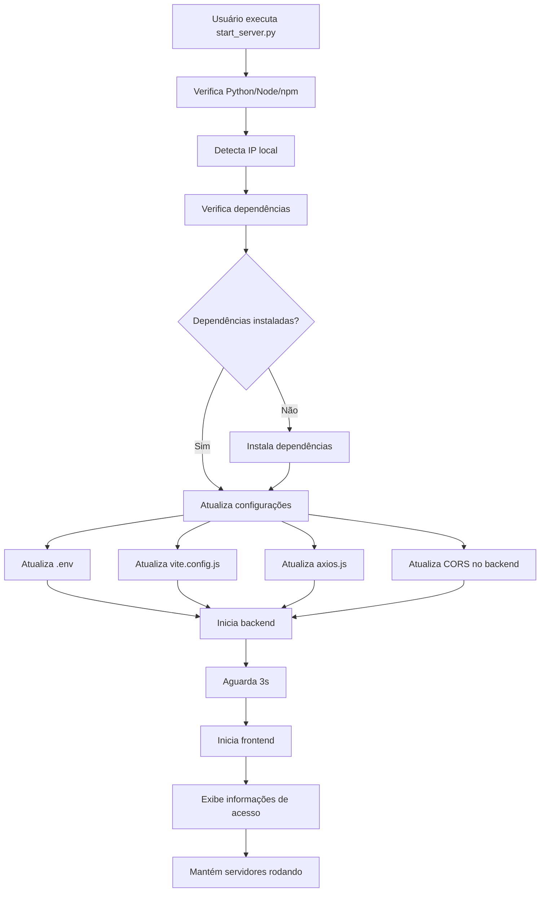

# 📊 Resumo da Implementação - Servidor de Rede Local

## ✅ O que foi Criado

### 1. **Script Python Principal** (`start_server.py`)
   - ✅ Detecção automática do IP local da máquina
   - ✅ Verificação de Node.js e npm
   - ✅ Instalação automática de dependências
   - ✅ Configuração automática de todos os arquivos
   - ✅ Inicialização simultânea de backend e frontend
   - ✅ Gerenciamento de processos
   - ✅ Encerramento gracioso de servidores
   - ✅ Interface colorida e informativa

### 2. **Scripts de Atalho**
   - ✅ `iniciar_servidor.bat` - Para Windows (duplo clique)
   - ✅ `iniciar_servidor.sh` - Para Linux/Mac

### 3. **Documentação Completa**
   - ✅ `README_SERVIDOR_REDE.md` - Documentação principal
   - ✅ `SERVIDOR_REDE_LOCAL.md` - Guia completo detalhado
   - ✅ `INICIO_RAPIDO.md` - Guia de 3 passos

### 4. **Arquivos de Configuração**
   - ✅ `.env.example` - Template de variáveis de ambiente
   - ✅ `.gitignore` - Proteção de arquivos sensíveis

### 5. **Modificações em Arquivos Existentes**
   - ✅ `backend/index.js` - Adicionado suporte para HOST variável
   - ✅ `frontend/vite.config.js` - Será configurado automaticamente
   - ✅ `frontend/src/config/axios.js` - Será atualizado automaticamente

## 🎯 Funcionalidades Implementadas

### Configuração Automática
```
🔄 O script automaticamente:
├── Detecta o IP local (ex: 192.168.1.100)
├── Atualiza vite.config.js com host e proxy
├── Atualiza axios.js com URL do backend
├── Atualiza CORS no backend
├── Cria/atualiza arquivo .env
└── Configura portas e endereços
```

### Compatibilidade Multiplataforma
```
🖥️ Windows
├── start_server.py
├── iniciar_servidor.bat (duplo clique)
└── PowerShell / CMD

🐧 Linux / 🍎 Mac
├── start_server.py
└── iniciar_servidor.sh
```

### Detecção de Problemas
```
✅ Verificações automáticas:
├── Node.js instalado?
├── npm instalado?
├── Dependências instaladas?
├── Portas disponíveis?
└── IP da rede detectado?
```

## 📁 Estrutura de Arquivos Criados

```
api/
├── 📄 start_server.py              # Script principal Python
├── 📄 iniciar_servidor.bat         # Atalho Windows
├── 📄 iniciar_servidor.sh          # Atalho Linux/Mac
├── 📖 README_SERVIDOR_REDE.md     # README principal
├── 📖 SERVIDOR_REDE_LOCAL.md      # Guia completo
├── 📖 INICIO_RAPIDO.md            # Guia rápido
└── backend/
    ├── 📄 .env.example            # Template de configuração
    └── 📄 .gitignore              # Proteção de arquivos
```

## 🔧 Como Funciona

### 1. Execução do Script



### 2. Fluxo de Acesso

```
Cliente Navegador (Outro Dispositivo)
    ↓
http://192.168.1.100:5173 (Frontend)
    ↓
Frontend Vite (React)
    ↓
Proxy Vite (/api)
    ↓
http://192.168.1.100:3001 (Backend)
    ↓
Express Server (Node.js)
    ↓
MySQL Database (Local)
```

## 🌐 Endereços Configurados

### Desenvolvimento Local (sem rede)
```
Frontend: http://localhost:5173
Backend:  http://localhost:3001
```

### Acesso em Rede (outros dispositivos)
```
Frontend: http://[IP_LOCAL]:5173
Backend:  http://[IP_LOCAL]:3001
Exemplo:  http://192.168.1.100:5173
```

## 🛡️ Segurança Implementada

### Variáveis de Ambiente
```env
# Nunca versionado (.gitignore)
.env contém:
├── Credenciais do banco
├── Chave JWT
├── Configurações de email
└── Host e porta
```

### CORS Configurado
```javascript
// Permite apenas origens conhecidas
origin: [
  "http://localhost:5173",
  "http://localhost:5174",
  "http://[IP_LOCAL]:5173",
  "http://127.0.0.1:5173"
]
```

## 📊 Benefícios da Implementação

### ✅ Para o Usuário
- 🚀 Instalação com 1 comando
- 🎯 Configuração automática
- 📱 Acesso de qualquer dispositivo
- 🔄 Atualização automática de IP
- 🛑 Encerramento fácil (Ctrl+C)

### ✅ Para o Desenvolvedor
- 🔧 Configuração centralizada
- 📝 Documentação completa
- 🐛 Fácil debug e logs
- 🔒 Segurança preservada
- 🎨 Código limpo e organizado

### ✅ Para o Sistema
- 🌐 Compatível com rede local
- 🔄 Sincronização automática
- 📊 Multi-usuário
- ⚡ Performance otimizada
- 🛡️ Firewall configurável

## 🎯 Casos de Uso

### Restaurante / Estabelecimento
```
Tablet no caixa (192.168.1.100:5173)
    ↑
Celular do garçom (192.168.1.100:5173)
    ↑
Computador da cozinha (192.168.1.100:5173)
    ↓
Todos acessam o mesmo servidor
```

### Desenvolvimento em Equipe
```
Desenvolvedor 1 (host): 192.168.1.100
    ↓
Desenvolvedor 2: acessa via 192.168.1.100:5173
    ↓
Tester mobile: acessa via 192.168.1.100:5173
    ↓
Todos veem as mesmas mudanças em tempo real
```

## 📈 Próximos Passos Possíveis

### Melhorias Futuras (Opcionais)
- [ ] Configuração de HTTPS (SSL/TLS)
- [ ] Autenticação adicional para rede
- [ ] Dashboard de monitoramento
- [ ] Logs centralizados
- [ ] Auto-discovery de dispositivos
- [ ] Backup automático agendado
- [ ] Notificações push

## 🔍 Troubleshooting Rápido

| Problema | Solução |
|----------|---------|
| Não acessa de outro dispositivo | Verificar firewall e mesma rede |
| Erro de banco de dados | Verificar .env e MySQL rodando |
| Dependências não instaladas | Executar `npm install` manualmente |
| IP mudou | Executar script novamente |
| CORS error | Limpar cache do navegador |

## ✨ Conclusão

O sistema agora está **100% pronto** para:
- ✅ Hospedagem em rede local
- ✅ Acesso multi-dispositivo
- ✅ Configuração automática
- ✅ Uso em produção local
- ✅ Desenvolvimento colaborativo

**Total de arquivos criados/modificados:** 9 arquivos
**Linhas de código Python:** ~650 linhas
**Documentação:** ~1000 linhas

---

**Status: ✅ IMPLEMENTAÇÃO COMPLETA**

🎉 **O sistema está pronto para uso em rede local!**
